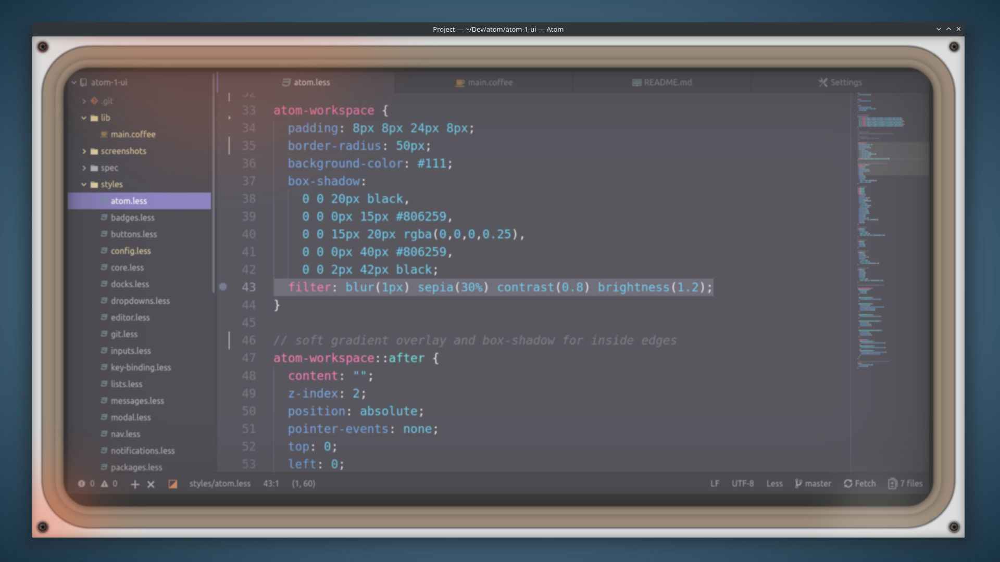
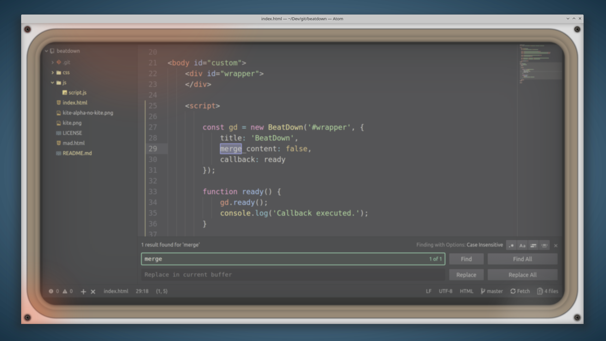

# Atom 1.0 UI

Meager attempt at replicating the aesthetics of the infamous [Atom 1.0 home computer](https://www.youtube.com/watch?v=Y7aEiVwBAdk) through the Atom editor software it inspired. Or maybe it was the other way around. Who knows.

This relatively simple fork of Atom One Dark UI just adds some much-needed 70s. Atom One was too modern and far too fast. This adds vintage 70s to slow it right down.

> CSS with [Styri syntax](https://atom.io/themes/styri-syntax) theme.

> HTML with Atom One Dark syntax.

> Markdown with Atom One Light syntax. It works with light themes, it's just real bright.

## Animations

70s color effects can be enabled in the theme settings with the `Enable animations` option. Please note, animation effects are very heavy so they slow things down real good and can eat your CPU.

## Credits

* [@GitHub Atom](https://atom.io/) - design concepts
* [@70s](https://en.wikipedia.org/wiki/1970s) - vintage consoles
* [@Atom One Dark UI](https://github.com/atom/one-dark-ui) - core UI design
* [@Ugotsta](https://github.com/Ugotsta) - wierd ideas

## Features
* 4 unicode screws.
* Lots of box-shadows for CPU to chew on.
* Optional CSS animations can ensure CPU is never idle.
